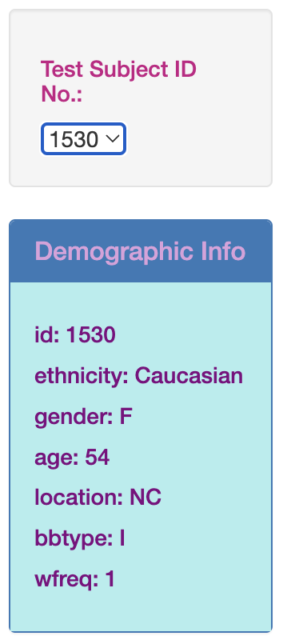
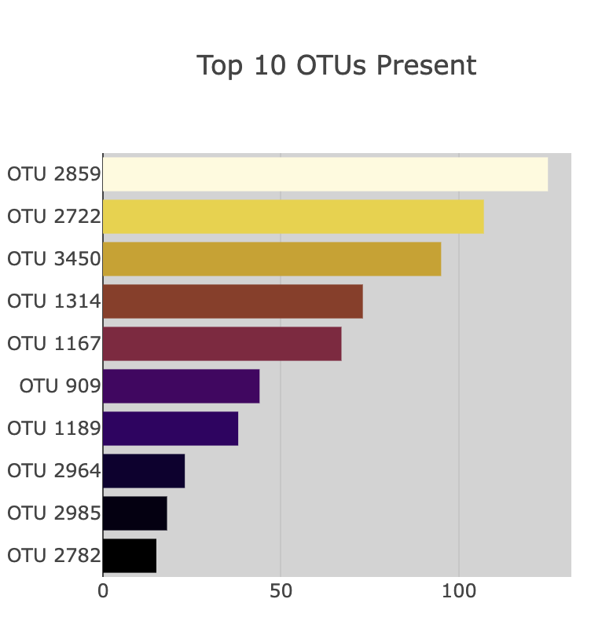
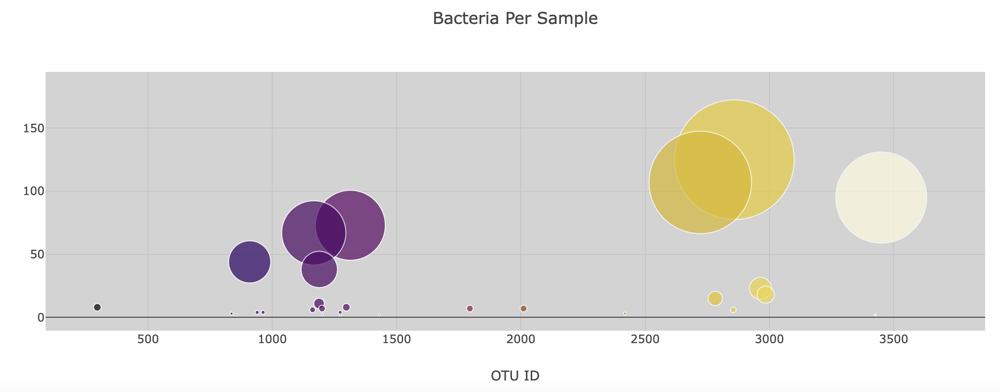
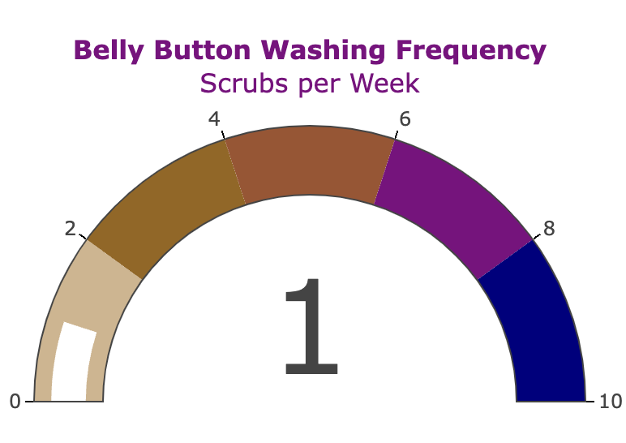

# belly-button-challenge
Module 14 Challenge for UM Bootcamp

Visit the site: https://loriandler.github.io/belly-button-challenge/ 

# Background
Based on the data, this dashboard was created to visualize the Belly Button Biodiversity dataset. This data catalogs the demographic information and charts associated with the data will all update with the microbes that colonize in human navels.  The dataset shows a small handful of microbial species (also called operational taxonomic units or OTUs) were present in more than 70% of people, while the rest were relatively rare.

## Dashboard Elements
1. I used the D3 library to read from the given URL: "https://2u-data-curriculum-team.s3.amazonaws.com/dataviz-classroom/v1.1/14-Interactive-Web-Visualizations/02-Homework/samples.json" 

2. I used the metadata provided to create a demographics panel that changes when a Test Subject ID No. is selected and displays information about each sample.

3. I used the sample_values, otu_ids and otu_labels to create a horizontal bar chart to display the top 10 OTUs found in the test subject.  Then used a plot.ly color scale of "Electric" and changed the background of that element to be able to see the light shades of the color scale when the data changes.

4. I created a bubble chart to display the bacteria present in the samples taken from the test subject.  otu_ids, sample_values, and out_labels were used to present the data.  I used the plot.ly color scale of "Electric" and changed the background on this item as well.

5. I created a gauge chart to display how often the test subject washed their belly button using the plot.ly javascript for gauge charts.

After completing the elements I worked with the layout and adjusted sizes and color elements to make a more cohesive dashboard.

# Credits
Thank you to the tutor, Limei Hou, who tried to helped me with the Bubble Chart part of the assignment and why it wasn't displaying correctly.  

Thank you to Hunter Hollis, instructor, and TA's Randy & Sam.
